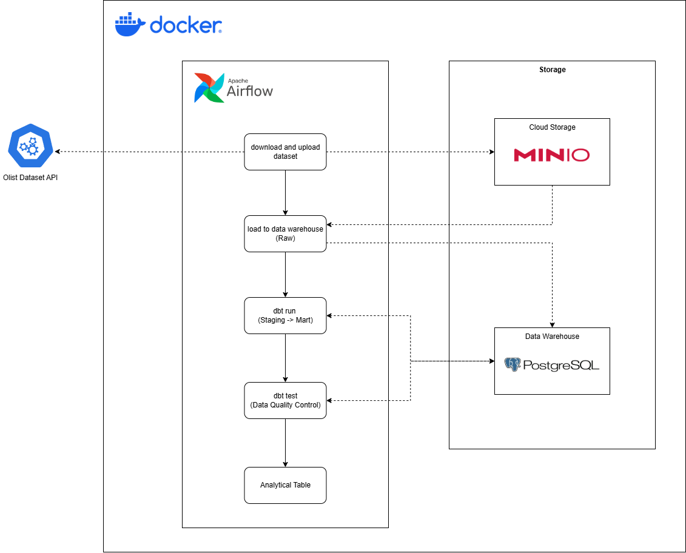

# Olist ELT Pipeline (Airflow + dbt + MinIO + Postgres)

## 📌 Overview

This project implements a **production-style ELT pipeline** using modern data engineering tools.

The pipeline ingests raw data, stores it in an S3-like data lake (MinIO), loads it into a data warehouse (Postgres), and transforms it into analytics-ready models using dbt, orchestrated by Airflow.

## 🏗️ Architecture



## ⚙️ Tech Stack

- **Orchestration:** Airflow  
- **Transformation:** dbt (Postgres adapter)  
- **Data Lake:** MinIO (S3-compatible)  
- **Data Warehouse:** Postgres  
- **Containerization:** Docker  

## 🔄 Data Flow

1. **Download & Ingest**
   - Dataset is downloaded programmatically
   - Uploaded directly to MinIO (no local storage)

2. **Load to Warehouse**
   - Data is fetched from MinIO
   - Loaded into Postgres under `raw` schema

3. **Transform (dbt)**
   - `raw` → `staging` (cleaning, casting, standardization)
   - `staging` → `mart` (fact & dimension models)

4. **Orchestration (Airflow)**
   - DAG execution order:
     ```
     download and upload dataset → load to postgres → dbt run → dbt test
     ```

## 🧱 Data Modeling

### Layered Approach

- **Raw**
  - Source-aligned tables (no transformation)

- **Staging**
  - Data cleaning
  - Type casting (e.g., TEXT → NUMERIC)
  - Standardized column naming

- **Mart**
  - Fact and dimension tables
  - Business-level modeling

### Example Models

- **Fact Tables**
  - `fct_orders`
  - `fct_order_items`
  - `fct_payments`

- **Dimension Tables**
  - `dim_customers`
  - `dim_products`
  - `dim_orders`
  - `dim_date`

## ✅ Data Quality

- dbt **generic tests**
  - `not_null`
  - `unique`

- dbt **custom tests**
  - Payment value should not be negative
  - Grain validation on fact tables

## 📊 Example Analysis

### Top 10 Customers by Spending

```sql
SELECT
    customer_id,
    SUM(payment_value) AS total_spent
FROM mart.fct_payments
GROUP BY customer_id
ORDER BY total_spent DESC
LIMIT 10;
```

---
---

# How to Run

### 1. Clone the repository

```
git clone https://github.com/your-username/olist-airflow-dbt-elt-pipeline.git
cd olist-airflow-dbt-elt-pipeline
```

---

### 2.Setup environment variables

Create a `.env` file:
```
POSTGRES_HOST=postgres
POSTGRES_PORT=5432
POSTGRES_DB=olist
POSTGRES_USER=postgres
POSTGRES_PASSWORD=postgres

MINIO_ENDPOINT=minio:9000
MINIO_ACCESS_KEY=minioadmin123
MINIO_SECRET_KEY=minioadmin123
MINIO_BUCKET=olist
MINIO_PREFIX=olist_project
```

---

### 3. Start services

```
docker compose up
```

⏳ First run may take a few minutes to install dependencies.

---

### 4. Access services

**Airflow**
- URL: http://localhost:8080
- Username: airflow
- Password: airflow

**MinIO**
- API Endpoint: http://localhost:9000
- Console UI: http://localhost:9001
- Username: minioadmin123
- Password: minioadmin123

**Database/Data Warehouse**
- Host: localhost
- Port: 5432
- Database: olist
- Username: postgres
- Password: postgres

You can connect using tools like: DBeaver, pgAdmin, psql

---

### 5.Run the pipeline

- Run the pipeline
- Find DAG: `olist_elt_pipeline`
- Click Trigger DAG

---

# 💡 Key Highlights
- End-to-end ELT pipeline (not just ETL scripts)
- Proper layered modeling (raw → staging → mart)
- dbt best practices (ref, source, tests)
- Containerized, reproducible setup
- S3-like architecture using MinIO

---

# 🔮 Next Improvements
- Deeper understanding of dbt (macros, incremental models, advanced testing)
- Partitioning strategy
- Data freshness monitoring
- Airflow alerting